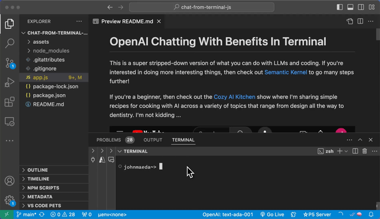

# OpenAI Chatting With Benefits In Terminal

## Getting Started

Have your OpenAI API key ready to input OR have it stored in your environment ahead of time with:

`export OPENAI_API_KEY="sk-..."` 

in your shell startup script. But you can instead just enter your API key in the convenient dialog box that pops up when this app starts.

If you can get this app to run, it looks like this from within VS Code or from your regular terminal experience:

## Installation

You'll need to have Node installed on your computer. That's pretty much all you need. At least I think so ...

1. Clone this repo
2. Run `npm install`
3. Run `npm start`
4. To exit hit `ctrl-c`

Enjoy!

## Todo

I ran out of time to get streaming running. If someone out there wants to make such a PR be my guest :+).

## Credits

I was watching Matthew Bolaños do this and got jealous so wanted to learn how to do it myself.